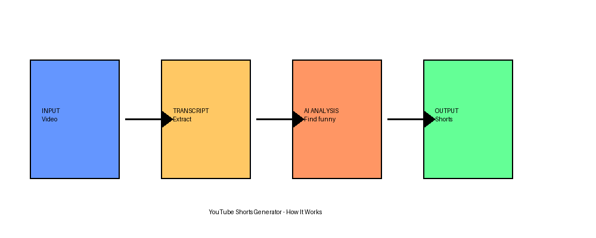
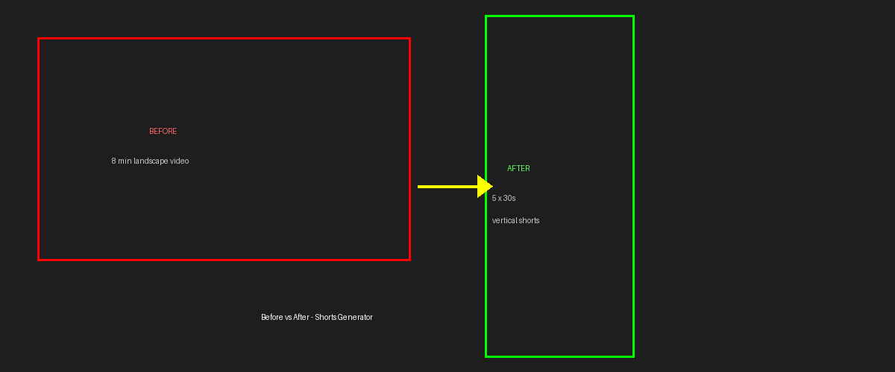
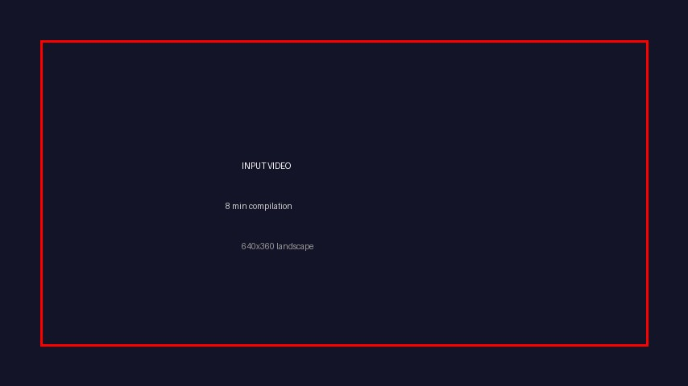
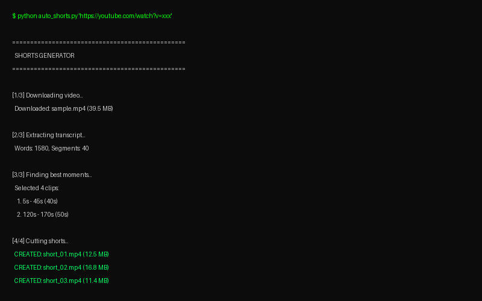

<div align="center">

# 🎬 Shorts Generator

### Auto-cut any YouTube video into vertical Shorts

[](https://python.org)
[](LICENSE)

**No API keys • Works with any video • 1080x1920 output**

</div>

---

## How It Works

<p align="center">
  
</p>

```
YouTube URL → Download → Transcript → AI Analysis → Cut Shorts → Done!
```

---

## Before & After

<p align="center">
  
</p>

| Input | Output |
|:-----:|:------:|
|  |  |
| 8 min landscape video | 5 × 30s vertical shorts |

---

## Terminal Output

<p align="center">
  
</p>

---

## Demo

### Generated Short

https://github.com/RootBugs/shorts-generator/assets/output/demo_short_01_small.mp4

> 30-second vertical short auto-generated from a 17-minute video

### GIF Preview

<p align="center">
  
</p>

---

## Quick Start

```bash
# Clone
git clone https://github.com/RootBugs/shorts-generator.git
cd shorts-generator

# Install
pip install -r requirements.txt

# Run
python auto_shorts.py "https://www.youtube.com/watch?v=VIDEO_ID"
```

---

## Commands

```bash
# Generate shorts from URL
python auto_shorts.py "URL"

# Generate 8 shorts
python auto_shorts.py "URL" --clips 8

# Skip ChatGPT (faster)
python auto_shorts.py "URL" --no-chatgpt

# Local video
python auto_shorts.py "C:\path\to\video.mp4"

# Interactive menu
python main.py
```

---

## Dependencies

```
moviepy>=2.0
yt-dlp>=2024.1.0
numpy>=1.25.0
Pillow>=9.2.0
imageio>=2.5.0
imageio-ffmpeg>=0.2.0
```

**System:** `ffmpeg` (install: `winget install ffmpeg`)

**Optional:** Node.js + Puppeteer (for ChatGPT integration)

---

## Config

Edit `config.py`:

```python
NUM_CLIPS = 5
MIN_CLIP_DURATION = 15
MAX_CLIP_DURATION = 58
SHORTS_WIDTH = 1080
SHORTS_HEIGHT = 1920
```

---

## Structure

```
shorts-generator/
├── auto_shorts.py      # Main pipeline
├── transcript.py       # Transcript extraction
├── cutter.py           # Video cutting
├── chatgpt.js          # AI analysis
├── config.py           # Settings
├── main.py             # Menu
├── requirements.txt    # Dependencies
└── assets/             # Demos & screenshots
```

---

## Troubleshooting

| Error | Fix |
|-------|-----|
| No transcript | Video needs subtitles |
| ffmpeg not found | `winget install ffmpeg` |
| Permission denied | Close players, run as admin |
| Slow | Use `--no-chatgpt` |

---

<div align="center">

**Made by [RootBugs](https://github.com/RootBugs)**

</div>
